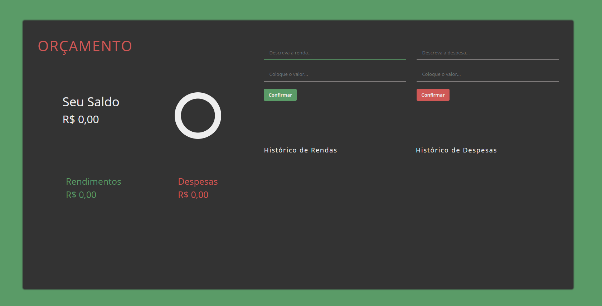
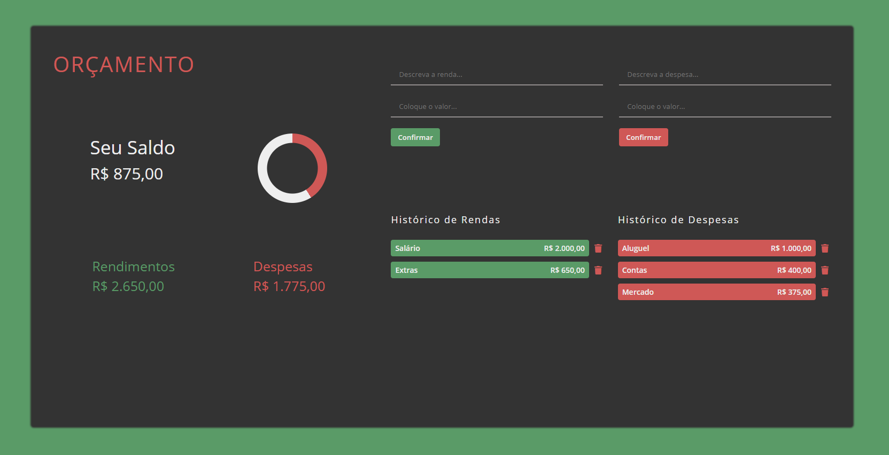
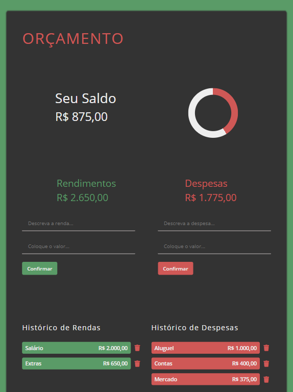
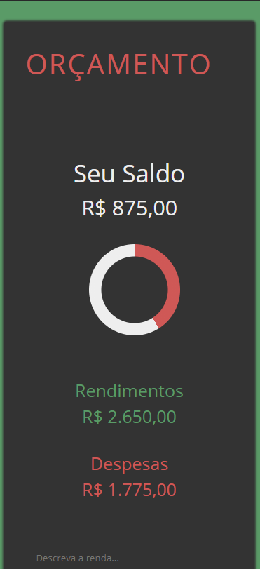
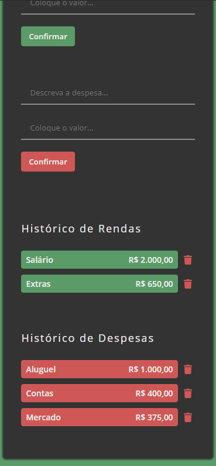

# Budget-App

Aplicação de Controle de Orçamento com SASS e JS puro, inspirado em um tutorial do youtube onde o mesmo app é feito com React:
https://www.youtube.com/watch?v=fDffQYs2WB0

- [x] Formatar números dos inputs para moeda local
- [x] Salvar dados no localStorage e inseri-los quando a página for atualizada ou iniciada
- [x] Calcular relação entre rendas e despesas com o total e exibir como gráfico circular

 
